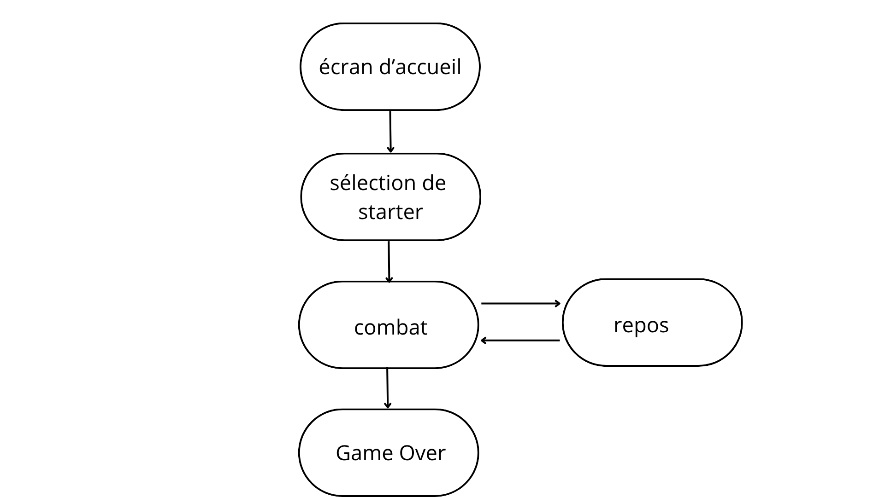

# introduction_c++_pokemon
TP introduction au c++

## fonctionnalités:
- interface graphique complète avec SFML
- écran de départ
- sélection d'un starter parmi trois pokémons générés aléatoirement
- série de combat en 1 contre 1 avec des pokémons jusqu'à défaite
- choix d'attaquer ou de fuir à chaque tour de combat
- état de repos après chaque combat
- possibilité de capturer un pokemon ennemi vaincu (limite à 6 pokémons, impossible de retirer un pokemon de l'équipe)
- nombre limité de soins par partie
- écran de game over

## structure du projet
Game   
 │  
 ├── GameState  
 │     ├── StartState  
 │     ├── SelectPokemonState  
 │     ├── BattleState  
 │     ├── RestState  
 │     └── GameOverState  
 │  
 ├── Pokemon_Party  
 │     └── pokemon  
 │  
 ├── PokemonSprite  
 │  
 └── Pokedex  
  
 
## pattern state:

